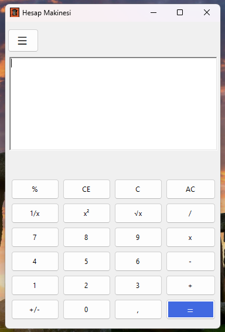
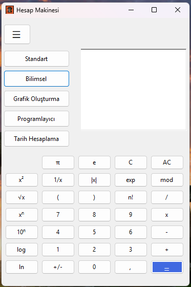
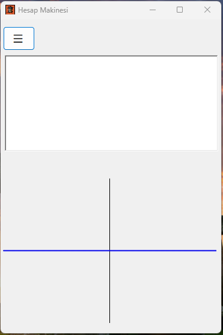
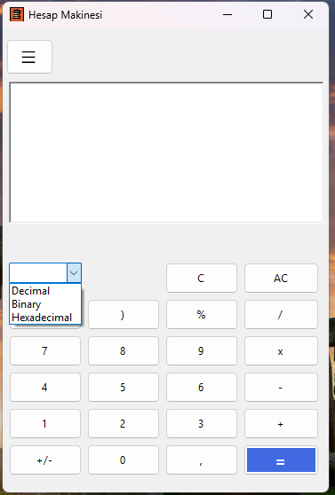
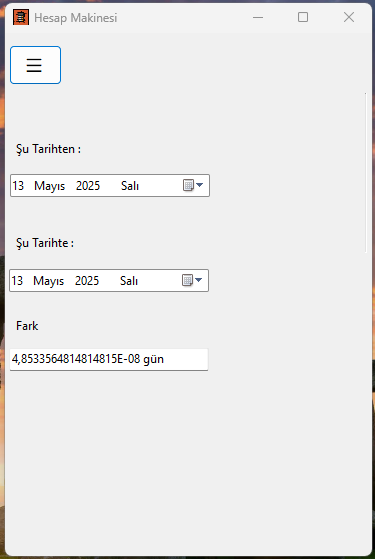

## Çok Amaçlı Hesap Makinesi Uygulaması ##
  Bu proje, Windows Forms (WinForms) kullanılarak geliştirilen kapsamlı bir hesap makinesi uygulamasıdır. Uygulama, farklı ihtiyaçlara yönelik 5 farklı mod içerir ve kullanıcı dostu bir arayüzle tüm bu özellikleri tek bir yerde sunar.

# Özellikler
  Uygulama şu 5 farklı hesaplama modunu destekler:

# Standart Hesap Makinesi
  Temel dört işlem (toplama, çıkarma, çarpma, bölme) gibi günlük hesaplamalar için idealdir.

# Bilimsel Hesap Makinesi
  Trigonometrik fonksiyonlar, logaritmalar, üstel işlemler gibi ileri matematiksel işlemleri içerir.

# Grafik Hesaplayıcı
  Matematiksel fonksiyonların grafiklerini çizer. Koordinat sistemi üzerinde görsel çıktı sunar.

# Programlayıcı Hesap Makinesi
  Sayıları ikili (binary), onluk (decimal), sekizlik (octal) ve onaltılık (hexadecimal) tabanlarda dönüştürür. Bit düzeyinde işlemler yapabilir.

# Tarih Hesaplayıcı
  İki tarih arasındaki gün farkını hesaplar.

#  Teknolojiler
   C# programlama dili
  .NET Framework (WinForms)
  Windows Forms Designer (Visual Studio)

  # Görseller
   
   
   
   
     
 

  # Kurulum
    Bu projeyi indir
    Visual Studio ile aç
    Uygulamayı çalıştır .

  # Lisans
Licensed under the [MIT License](LICENSE).
  # Katkı Sağla
    Her türlü katkı, öneri veya geri bildirim memnuniyetle karşılanır! Projeyi forkladıktan sonra Pull Request gönderebilirsin.
